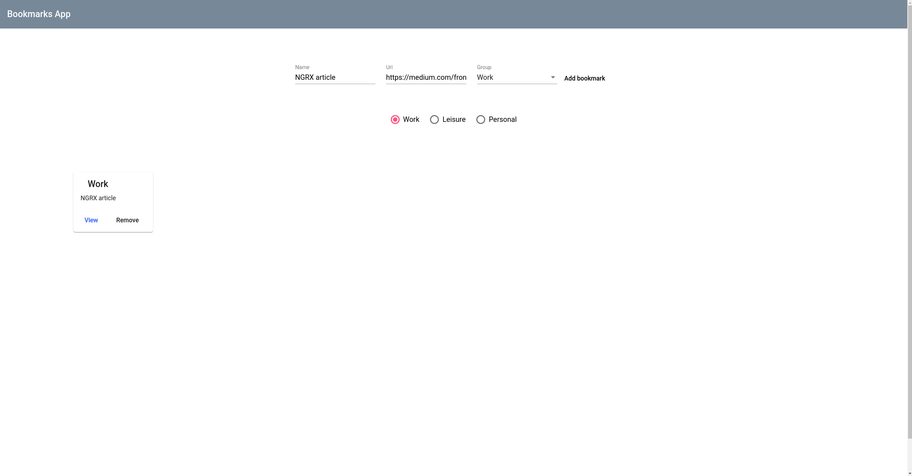

# BookmarksApp

The BookmarksApp was created as an assignment for the recruiting process.

The application allows to create, remove and filter bookmarks by categories.

## Technologies used in the project
* Angular 8 for creating the app
* NGRX for managing the state
* Angular Material for the design

## Preview

## Run the application

Before start the application run `npm install` to install all required dependencies.

Run `npm start` for a dev server. Navigate to `http://localhost:4200/`.